% Introduction to git & GitHub
% Presentation: [arbr.dk/github.html](http://www.arbr.dk/github.html)
% Demo repo: [TBroedsgaard/github-demo](https://github.com/TBroedsgaard/github-demo)

## Agenda:
    
- About git
    - Basic workflow
    - git demo, how it works
- About GitHub
    - [GitHub Flow](http://scottchacon.com/2011/08/31/github-flow.html)
    - [Project Management](http://net.tutsplus.com/articles/general/team-collaboration-with-github/) (briefly)
- Hands-on demo
    - GitHub for Windows
    - Creating and merging branches
    - Merge conflicts
- Questions 
    - extras / beer
    
## You need:

- [GitHub for Windows](http://windows.github.com/)
- [GitHub account](https://github.com/)

## git:
    
- "fast, scalable, distributed revision control system"
    - Repository (archive) with full history (versioning)
    - Local copy (fast, good for offline usage)
    - Powerful and cheap branching and merging
    - Flexible: a workflow for any project
    - not an improved version of SVN - very different
    
> - "the stupid content tracker"
    - You can break your repo
    - git cannot fix it for you
    - But it wants to help you    
    
## Basic git workflow:
    
- Develop features in iterations
    - Write minimum code to make it work
    - Stage and commit changes
    - Iterate, adding try-catch
    - Stage and commit changes
    - Iterate, clean up code (add comments etc)
    - Stage and commit changes
    - Move on...

- Develop features in isolation
    - Need a new feature? Get a new branch!
    - You can experiment in the branch without breaking your main program
    - When it works, you merge the new and main branches
    - If it never works, you throw it away
    - Several branches for several features

## git basics demo:
    
- Directory with two files:
    
~~~
git init // create local repo
git status // get status
~~~

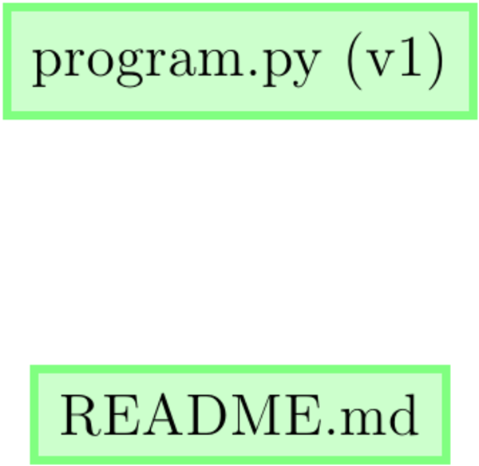

## git basics demo:

- Do first commit

~~~
git add . // add all untracked files to staging
git commit -m "message" // commit with message
~~~

## git basics demo:
    
- More work, second commit

~~~
git status // check status
git diff // line-by-line comparison
git commit -am "message" // add all tracked files to staging and commit with message 
git log // show commit log
~~~

## git basics demo:
    
- Introducing HEAD

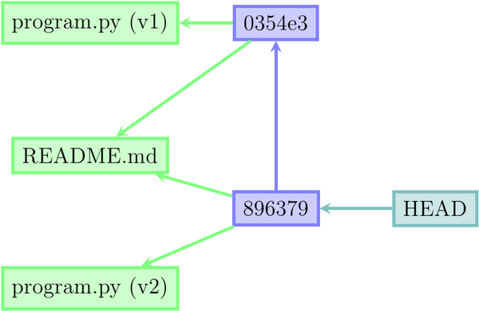

## git basics demo:
    
- Point HEAD at commit
    
~~~
git checkout <commit> // point HEAD at commit
git status
~~~

## git basics demo:

- Introducing branches

~~~
git branch // list branches
git checkout master // point HEAD at master
~~~

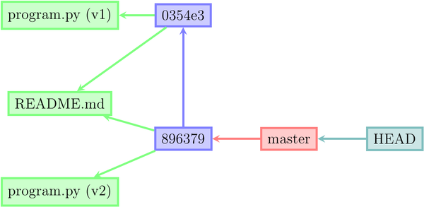

## git basics demo:
    
- Branching

~~~
git branch answer-hello // create branch answer-hello
git checkout answer-hello // point HEAD at answer-hello
~~~

- Do some work, commit

~~~
git status // check status
git commit -am "message" // add all tracked files to staging and commit with message 
~~~

## git basics demo:
    
- To illustrate merging, do some stuff on master:
    
~~~
git checkout master
// do work
git commit -am "message"
~~~

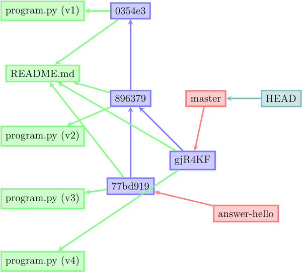

## git basics demo:
    
- Merge branches:
    
~~~
git merge answer-hello // merge answer-hello into your current branch
git log --graph --oneline --decorate // pretty!
~~~

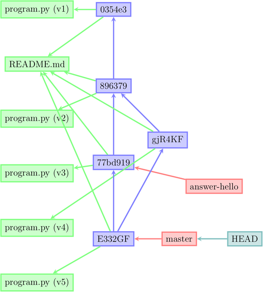

## git basics demo:
    
- Working with remotes:    
    
~~~
git remote add origin <repo url> // add remote with repo url and call it origin
~~~
    
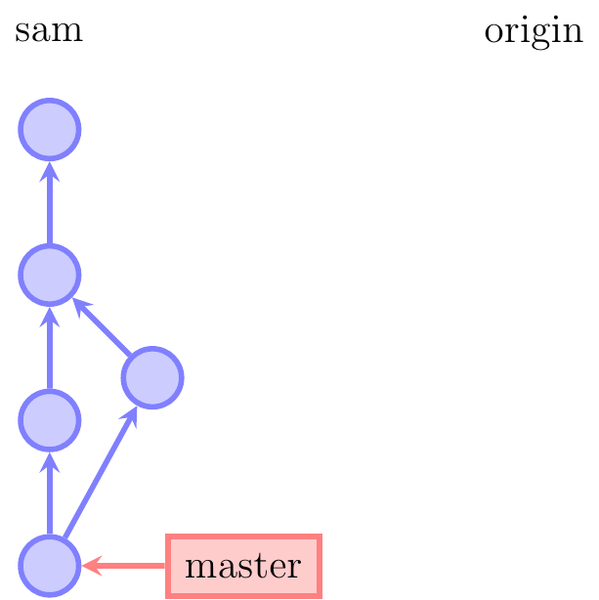    

## git basics demo:
    
~~~
git push origin master // push master to remote repo called origin
~~~

## git basics demo:

~~~
git clone <repo url> // make local clone of remote repo
~~~

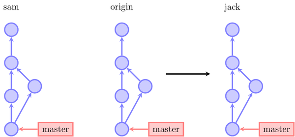

## git basics demo:
    
~~~
// do work
git commit -am "message"
~~~

## git basics demo:
    
~~~
git push origin master
~~~

## git basics demo:
    
~~~
git pull origin master
~~~
    

## git basic commands:

~~~ 
git init // create local repo
git status // get status
git add . // add all untracked files to staging
git commit -m "message" // commit with message
git diff // line-by-line comparison
git commit -am "message" // add all tracked files to staging and commit with message 
git log // show commit log
git checkout <commit> // point HEAD at commit
git branch // list branches
git checkout master // point HEAD at master
git branch answer-hello // create branch answer-hello
git checkout answer-hello // point HEAD at answer-hello
git merge answer-hello master // merge answer-hello into master
git clone <repo url> // get everything from repo url
git push origin master // push new commits to origin/master
git pull origin master // pull new commits from origin/master
~~~

## git basic branching and merging:    

- The master branch is sacred (contains working code)
- New features developed in seperate branches
- To bring a feature into master you merge the branch containing the feature
- To maintain virginity of master: 
    - merge master into the feature branch
    - make sure the code compiles (and works)
    - only now push to master
    - to achieve nirvana: **never** push to master - use pull request

## git-flow:

    

## GitHub:

- "Social coding"
- Central repo hosting
- Issue management (and wiki and other awesome features)
- Pretty stable
- De facto standard for open source (forking, pull request)
- Team and organization repo
- Expensive for private repo

## GitHub-flow:
    
    

- master is always in a deployable state
- Bugfixes and features developed in seperate branches
- Keeps it simple 
- Easy to learn, difficult to screw up real bad
- Works both with team repo and forked repos

## GitHub-flow step by step:

- Create a repo on GitHub, invite team members
- Clone the repo to an empty folder using GH4W
- Either copy your existing solution-folder into the new folder or create a new solution
- Create a new branch locally with GH4W, select it and publish it - always do your own work in your own branch
- Now do your work and commits
- when the feature is done, do a pull request on GitHub
- Remember to sync master once a day, and merge it into your working branch

## Project management:
    
- Issues & Milestones
- [Huboard](http://www.huboard.com) - Beta version rocks
- Pull request as discussion
- Code review
- No timetracking & burndown :( (do it yourself)
    
## Break:

- Post your username to [issue #1](https://github.com/TBroedsgaard/github-demo)

## Hands-on:
    
- Create branch    

    

- Do work, then commit

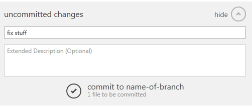    

- Publish

    

- Pull request

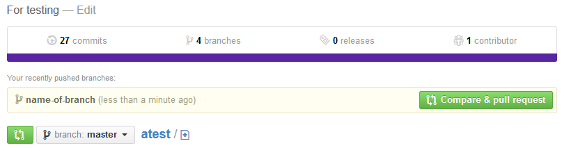

## Merge conflicts:
    
- Merge in GH4W:

    
- Boom!

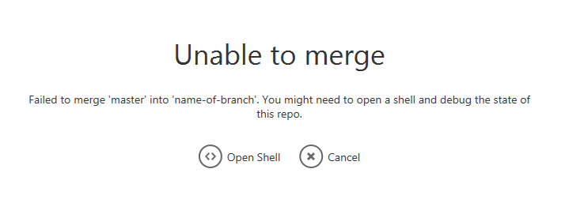

## git status to the rescue!

~~~
git status // read and comprehend
~~~

## Fix conflict in src/atest/atest/Program.cs:
    
- Before:
    
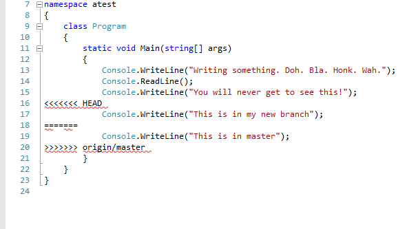
    
- After:

## Commit to complete merge (commandline):
    
- stage
    
~~~
git status
git add <filename>
git status
~~~

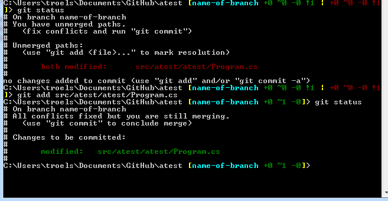

- and commit (can also be done in GH4W)

~~~
git commit - m "message"
git status
~~~

  
    
## Merge conflict summary:
    
- Try to merge, conflict breaks your repo
- Find conflicted files with git status
- Fix conflict in Visual Studio
- Stage and commit

## Resources:

- [git reference](http://gitref.org/)
- [Pro Git](http://git-scm.com/book)
- [Code School](https://www.codeschool.com/)
    - Try Git 
    - Git Real 1 & 2
    
## Questions / extras / beer    

- GH4W and commandline sucks? Try SourceTree
- GitHub sucks? Try Bitbucket (or GitLab)
- rebase, squash to rewrite history
- add only parts of file to staging